# IDE - PhpStorm

This project includes some shell-scripts to develop a web application using Symfony Framework

## Abstract

* App (PHP) + Cache (Redis) + Database (PostgreSQL) + Server (Nginx)

## Dev Environment

### Platform

* Linux
* MacOS
* Windows

### Settings

#### PHP

* CLI Interpreter

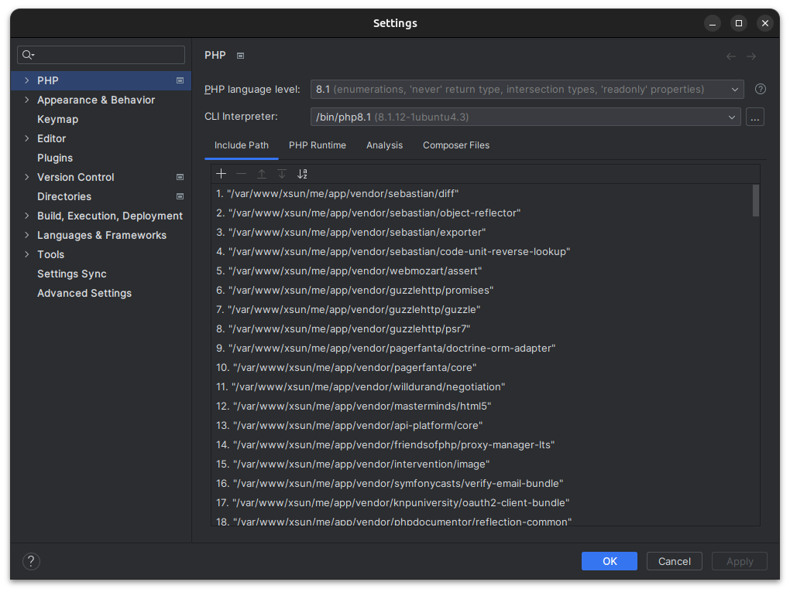</img>

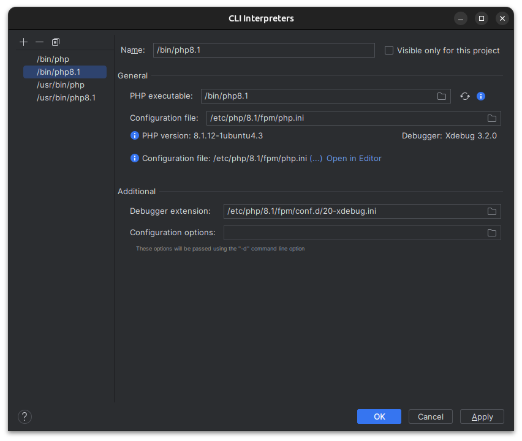</img>

</img>

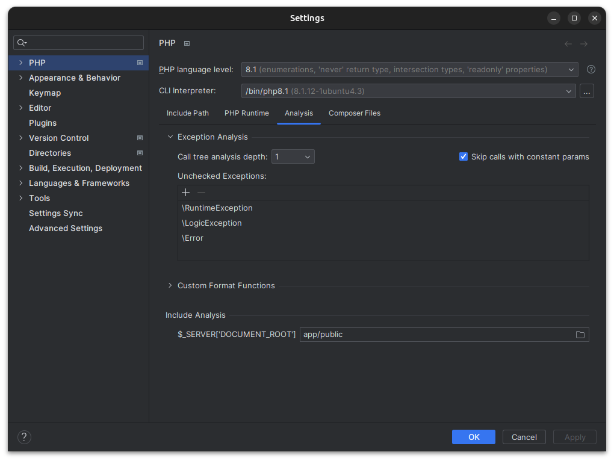</img>

* Debug

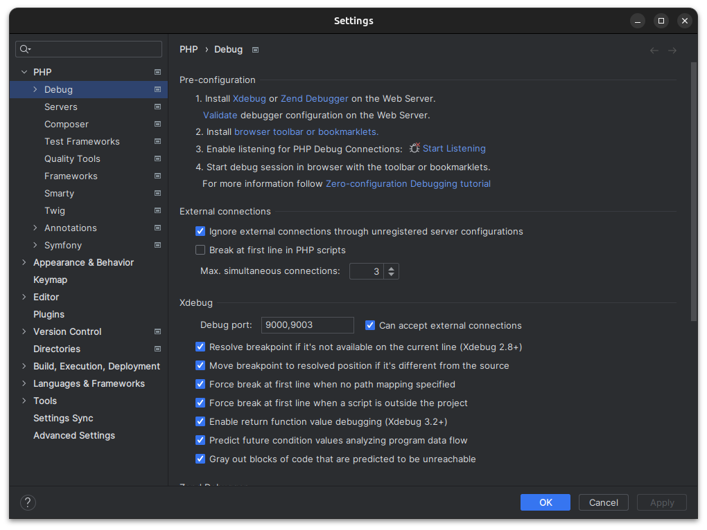</img>

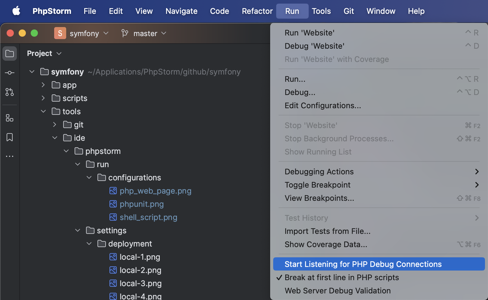</img>

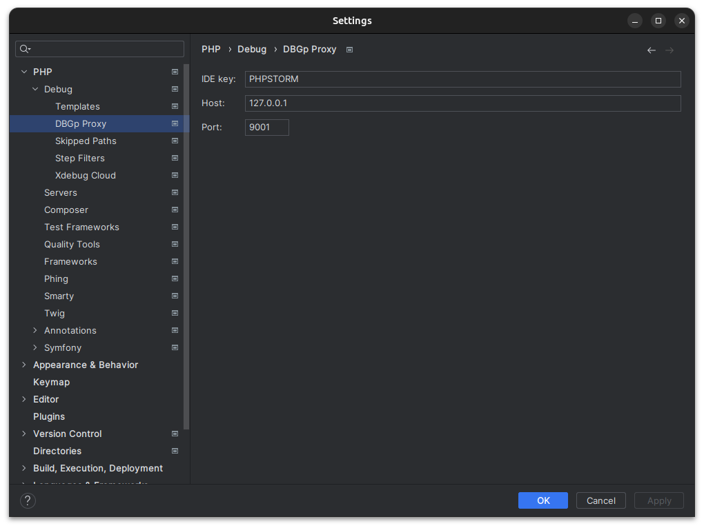</img>

* Servers

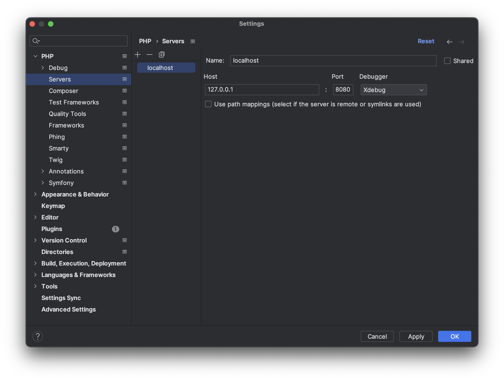</img>

* Symfony

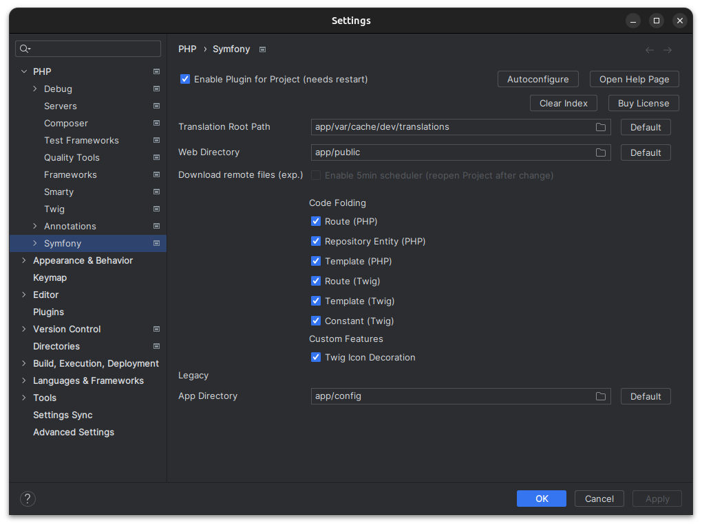</img>

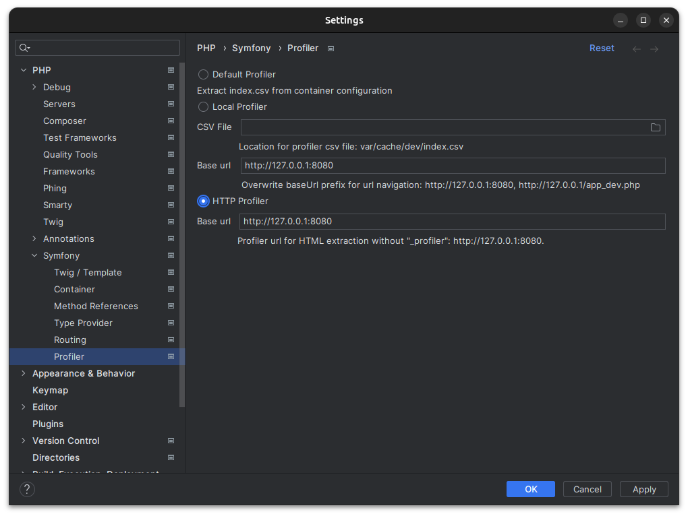</img>

#### Directories

* Symfony Framework

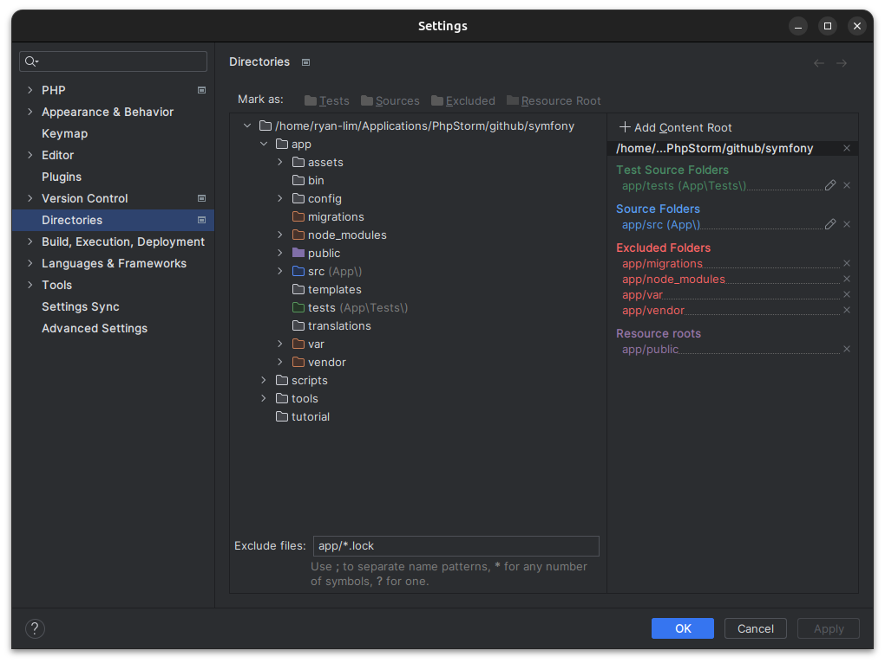</img>

#### Build, Execution, Deployment
* [Deployment](https://github.com/xsuntel/symfony-scripts/blob/main/tools/ide/phpstorm/settings/deployment/README.md)

#### Run/Debug Configurations

* PHP Web Page

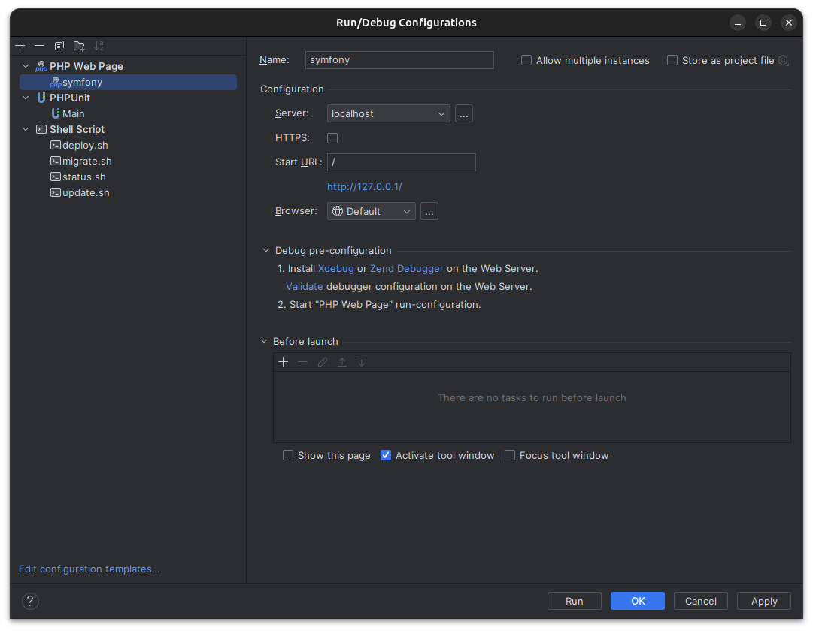</img>

* PHPUnit

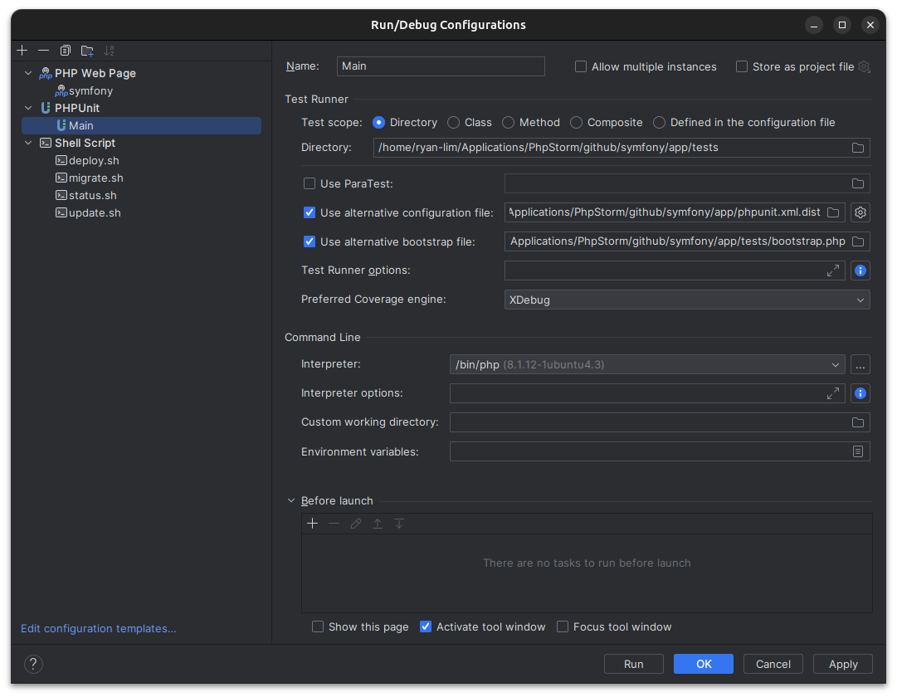</img>

* Shell Script

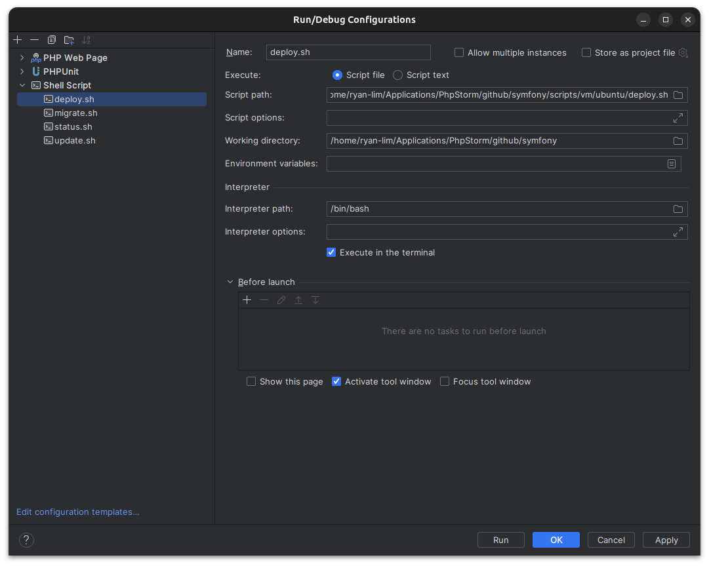</img>

### Project

* Check device in Dev

```
[user@localhost] ./tools/ide/phpstorm/check.sh
```
* 
* Install PhpStorm in Dev

```
[user@localhost] ./tools/ide/phpstorm/install.sh
```

## Reference

### Tools

* IDE
  * [PhpStorm](https://www.jetbrains.com/phpstorm)
    * Settings
      * PHP
        * Xdebug - [Configuration](https://www.jetbrains.com/help/phpstorm/debugging-with-phpstorm-ultimate-guide.html)
      * Deployment - [Deploying application](https://www.jetbrains.com/help/phpstorm/deploying-applications.html) 
      * Symfony - [Symfony Framework](https://www.jetbrains.com/help/phpstorm/symfony-support.html#use_symfony_cli)
      
* Web browser - [ Firefox - Settings - Exceptions - Cookie and Site Data](https://github.com/xsuntel/symfony-scripts/blob/main/tools/webbrowser/firefox/Abstract.md)
