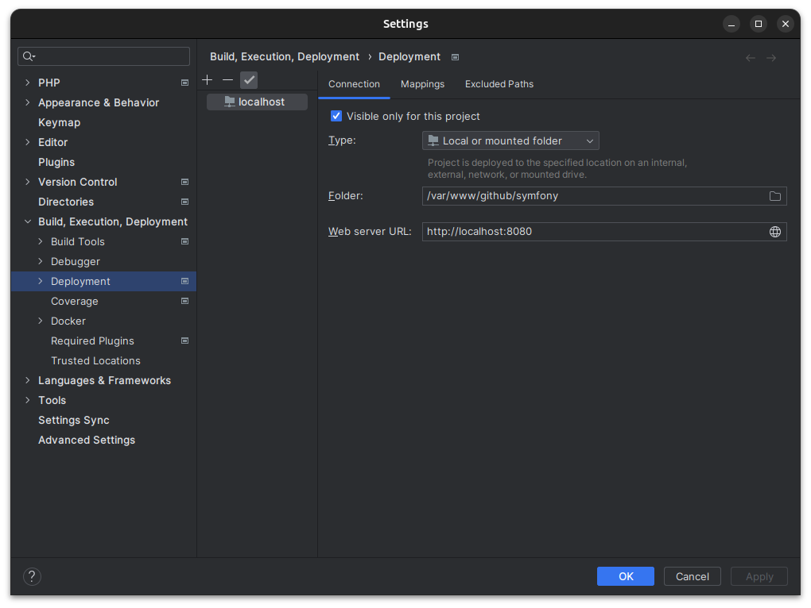
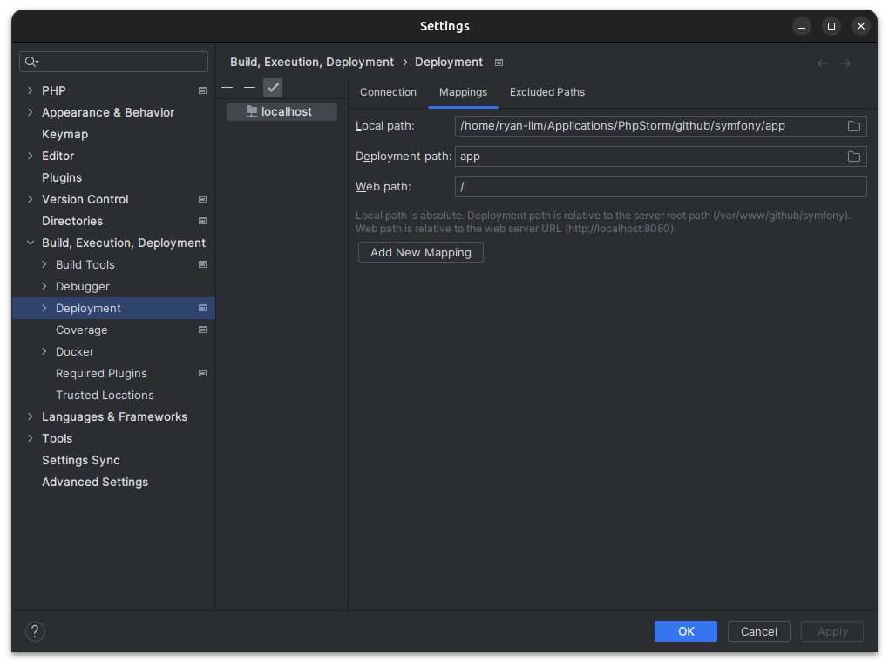
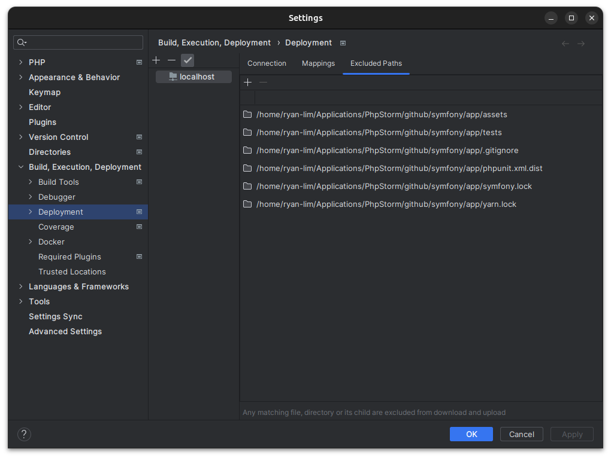
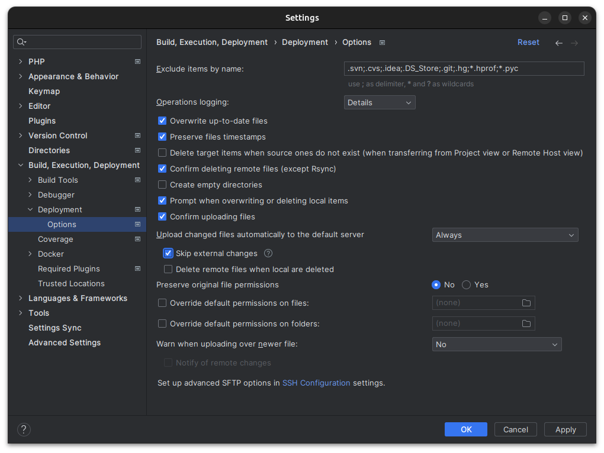
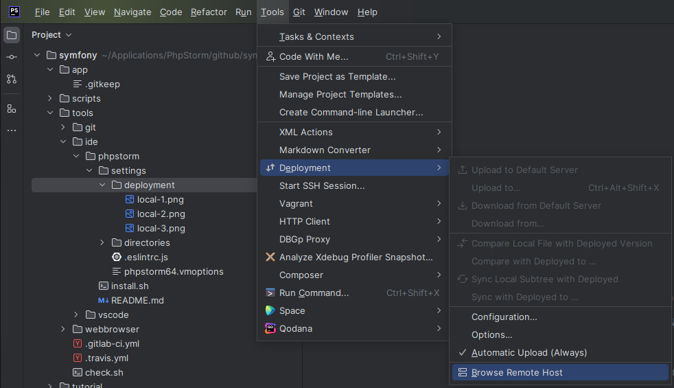

# IDE - PhpStorm

This project includes some shell-scripts to develop a web application using Symfony Framework

## Abstract

* App (PHP) + Cache (Redis) + Database (PostgreSQL) + Server (Nginx)

## Dev Environment

### Platform

* Linux

```
[user@localhost] ./tools/ide/phpstorm/install.sh
```

### Settings

#### Deployment

* Local or mounted folder

</img>

</img>

</img>

</img>

</img>

## Reference

### Tools

* IDE
  * [PhpStorm](https://www.jetbrains.com/phpstorm)
    * Settings
      * Deployment - [Deploying application](https://www.jetbrains.com/help/phpstorm/deploying-applications.html) 