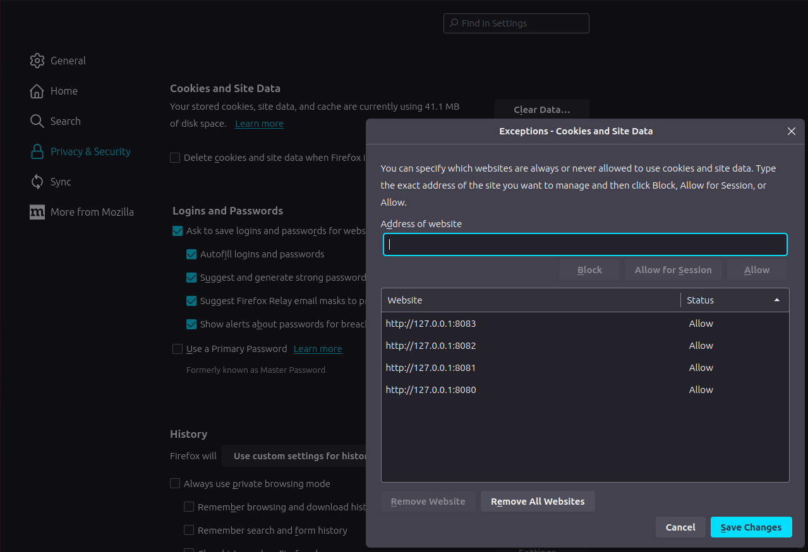

# Web Browser - Firefox

This project includes some shell-scripts to develop a web application using Symfony Framework

## Abstract

* App (PHP) + Cache (Redis) + Database (PostgreSQL) + Server (Nginx)

## Dev Environment

### Platform

* Linux
* MacOS
* Windows

### Web browser

* Firefox

### Settings

#### Privacy & Security

* Exceptions - Cookie and Site Data

</img>

## Reference

### Tools

* Web browser
  * [Firefox](https://www.mozilla.org)
    * Settings
      * Extension - [Xdebug Helper](https://github.com/BrianGilbert/xdebug-helper-for-firefox) 